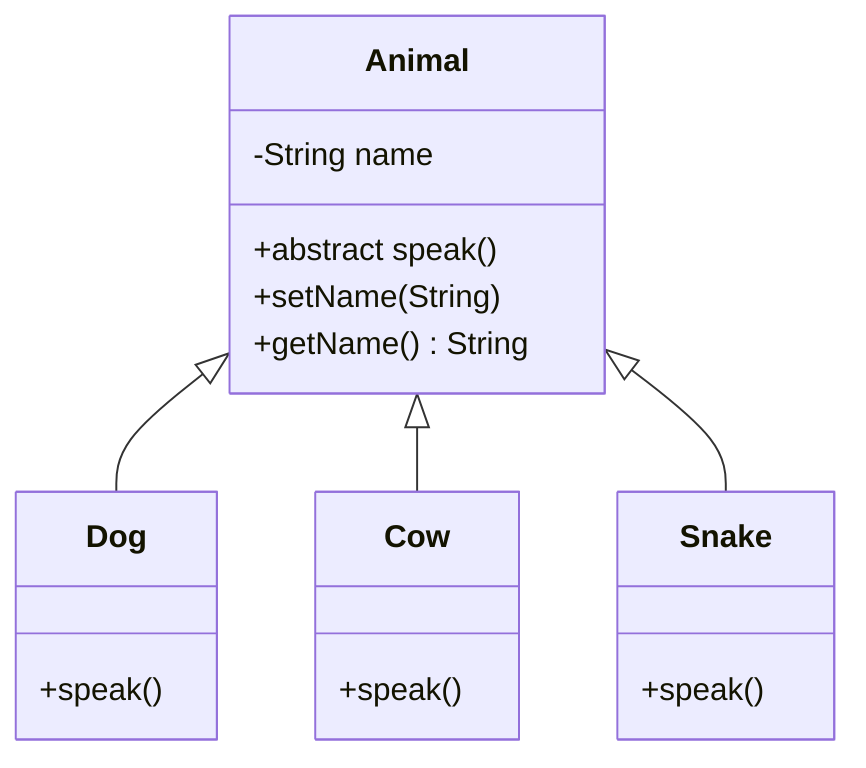

#  Animal Abstraction Sample

A Java project that uses abstract class and inheritance.

##  Project Structure

### Core Components
| File | Description |
|------|-------------|
| `Animal.java` | Abstract base class defining common properties |
| `Dog.java` | Concrete class implementing speak method |
| `Cow.java` | Concrete class implementing speak method |
| `Snake.java` | Concrete class implementing speak method |
| `UseAnimals.java` | Main class demonstrating polymorphism |

##  Class Diagram

## Code:
### Super Class:
```java
public abstract class Animal {

  private String name;
  
  public abstract void speak ( );

  public String getName ( ) {
    return name;
  }

  public void setName ( String name ) {
    this.name = name;
  }
}

```
### Sub-classes:
```java
public class Dog extends Animal {
  @Override
  public void speak ( ) {
    System.out.println( "Woof!" );
  }
}

```
```java
public class Cow extends Animal {
  public void speak ( ) {
    System.out.println( "Moo!" );
  }
}

```
```java
public class Snake extends Animal {
  public void speak ( ) {
    System.out.println( "Ssss!" );
  }
}

```
_notice I didn't put the keyword `@Override` in the `Cow` and `Snake` classes? Its because the compiler does it automatically without needing to put that keyword._
### Main:
```java
public class UseAnimals {

  public static void main(String[] args) {
    
    Dog myDog = new Dog();
    Cow myCow = new Cow();
    Snake mySnake = new Snake();

    myDog.setName("My dog Browny");
    myCow.setName("My cow Milky");
    mySnake.setName("My snake Vipey");
    
    System.out.println( myDog.getName()+ " says "); myDog.speak();
    System.out.println( myCow.getName()+ " says "); myCow.speak();
    System.out.println( mySnake.getName()+ " says "); mySnake.speak();
    
  }
}
```
---
### Sample Output:
