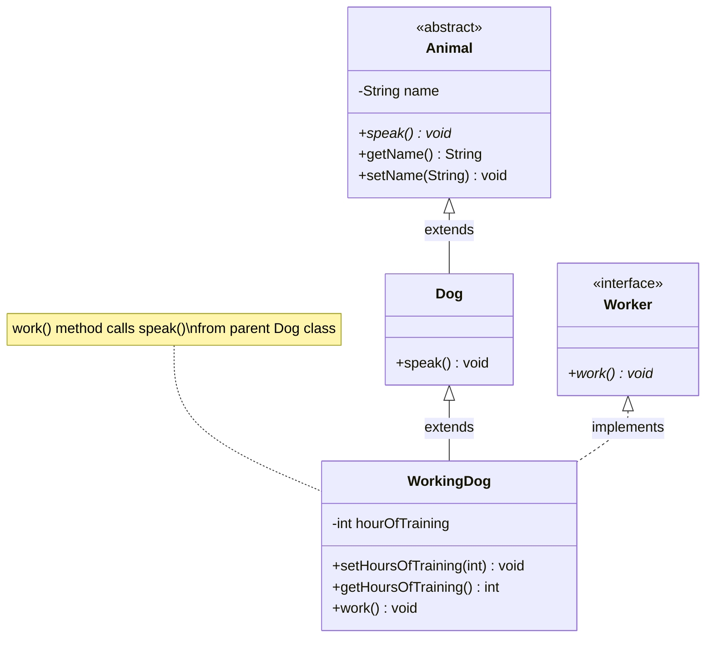

# Animal Hierarchy with Worker Interface

A Java project demonstrating advanced object-oriented programming concepts including abstract classes, interfaces, inheritance, and polymorphism with a working dog example.

## Project Structure

### Class/Interface Hierarchy

Animal (Abstract Class)  
│  
└── Dog (Concrete Class)  
│  
└── WorkingDog (Concrete Class, implements Worker)  
│  
└── Implements Worker (Interface)

### Files
| File | Description |
|------|-------------|
| `Animal.java` | Abstract base class with name property |
| `Worker.java` | Interface defining work() method |
| `Dog.java` | Concrete class extending Animal |
| `WorkingDog.java` | Specialized dog that implements Worker |
| `Main.java` | Demonstration class with main method |
---
### Class Diagram

---

### Codes:

#### Animal.java (Abstract Class)
```java
public abstract class Animal {
  private String name;
  
  public abstract void speak();
  
  public String getName() {
    return name;
  }
  
  public void setName(String name) {
    this.name = name;
  }
}
```
#### Worker.java (Interface)

```java
public interface Worker {
  public void work();
}
```
#### Dog.java (Concrete Class)

```java
public class Dog extends Animal {
  public void speak() {
    System.out.println("Woof!");
  }
}
```
#### WorkingDog.java (Specialized Class)

```java
public class WorkingDog extends Dog implements Worker {
  private int hourOfTraining;
  
  public void setHoursOfTraining(int hourOfTraining) {
    this.hourOfTraining = hourOfTraining;
  }
  
  public int getHoursOfTraining() {
    return hourOfTraining;
  }
  
  public void work() {
    speak();
    System.out.println("I am a dog who works");
    System.out.println("I have " + hourOfTraining + " hours of professional training!");
  }
}
```
#### Main.java (Demonstration)

```java
public class Main {
  public static void main(String[] args) {
    WorkingDog aSheepHerder = new WorkingDog();
    WorkingDog aSeeingEyeDog = new WorkingDog();
    
    aSheepHerder.setName("Simon, the Border Collie");
    aSeeingEyeDog.setName("Sophie, the German Shepherd");
    
    aSheepHerder.setHoursOfTraining(40);
    aSeeingEyeDog.setHoursOfTraining(300);
    
    System.out.println(aSheepHerder.getName() + " says ");
    aSheepHerder.speak();
    aSheepHerder.work();
    
    System.out.println();
    
    System.out.println(aSeeingEyeDog.getName() + " says ");
    aSeeingEyeDog.speak();
    aSeeingEyeDog.work();
  }
}
```
---
### Expected Output

```text
Simon, the Border Collie says 
Woof!
I am a dog who works
I have 40 hours of professional training!

Sophie, the German Shepherd says 
Woof!
I am a dog who works
I have 300 hours of professional training!
```
---
### Advanced OOP Concepts Demonstrated

1.  **Abstract Classes**
    
    -   `Animal` class defines abstract method `speak()`
        
    -   Cannot be instantiated directly
        
2.  **Interfaces**
    
    -   `Worker` interface defines `work()` method contract
        
    -   Classes implement interfaces to guarantee behavior
        
3.  **Inheritance Hierarchy**
    
    -   `Dog` extends `Animal`
        
    -   `WorkingDog` extends `Dog` and implements `Worker`
        
4.  **Polymorphism**
    
    -   `WorkingDog` objects can be treated as `Animal`, `Dog`, or `Worker`
        
    -   Method overriding with `speak()` and `work()` implementations
        
5.  **Encapsulation**
    
    -   Private fields with public getters/setters
        
    -   Controlled access to internal state

----------

_"Interfaces allow us to define capabilities that cut across class hierarchies, enabling objects of different types to share common behaviors."_ - Java Design Principles